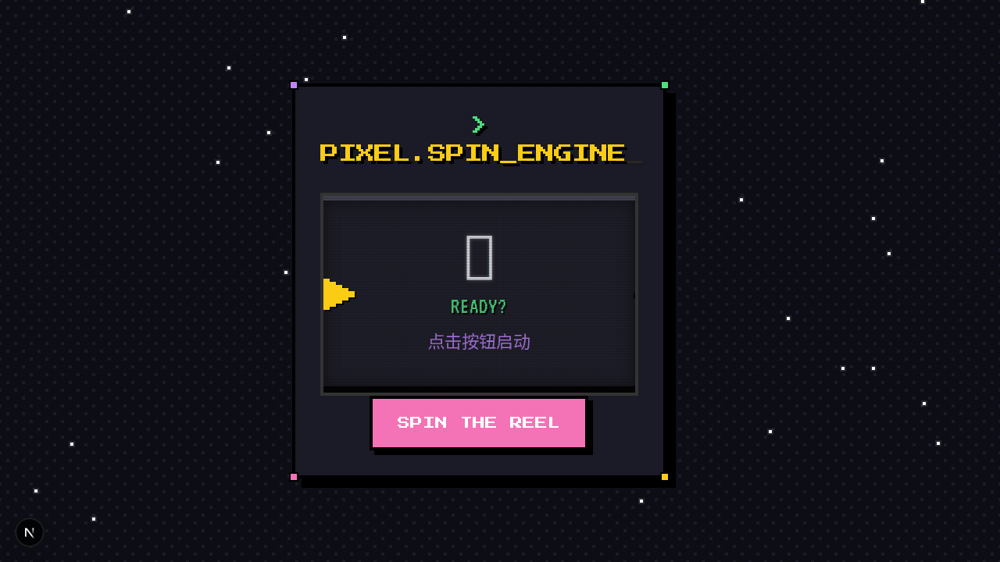

# Pixel Spin Engine

A retro-themed slot machine for generating conversation starters, built with Next.js, TypeScript, and Tailwind CSS.



## Getting Started

First, install the dependencies:

```bash
bun install
```

Then, run the development server:

```bash
bun dev
```

Open [http://localhost:3000](http://localhost:3000) with your browser to see the result.
